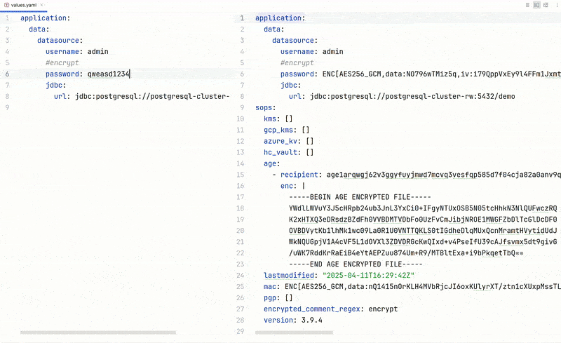

    

<h1 align="center">SOPS IntelliJ Plugin</h1>

SOPS for IntelliJ based IDEs/Android Studio.

 

- [Description](#description)
- [Features](#features)
- [Compatibility](#compatibility)
- [Install](#install)
- [Installation from zip](#installation-from-zip)

[//]: # (- [Demo]&#40;#demo&#41;)

## Description

SOPS IntelliJ plugin allows you to decrypt and encrypt files encrypted with SOPS inside your IDE. To get started, install the plugin and configure path to SOPS executable in plugin's settings: <kbd>Settings</kbd> > <kbd>Tools</kbd> > <kbd>SOPS</kbd>

## Features

- Automatically decrypt the content of SOPS files.
- Show encrypted content as preview.
- On save, encrypt the contents, if the file has changed.

[//]: # (## Demo)

[//]: # ()

[//]: # (<picture>)

[//]: # (  <source media="&#40;prefers-color-scheme: dark&#41;" srcset="./screenshots/plugin-dark.gif">)

[//]: # (  <source media="&#40;prefers-color-scheme: light&#41;" srcset="./screenshots/plugin-white.gif">)

[//]: # (  )

[//]: # (</picture>)

## Compatibility

IntelliJ IDEA, PhpStorm, WebStorm, PyCharm, RubyMine, AppCode, CLion, GoLand, DataGrip, Rider, MPS, Android Studio,
DataSpell, Code With Me

## Install

Or you could install it inside your IDE:

For Windows & Linux: <kbd>File</kbd> > <kbd>Settings</kbd> > <kbd>Plugins</kbd> > <kbd>Marketplace</kbd> > <kbd>Search for "SOPS"</kbd> > <kbd>Install Plugin</kbd> > <kbd>Restart IntelliJ IDEA</kbd>

For Mac: <kbd>IntelliJ IDEA</kbd> > <kbd>Preferences</kbd> > <kbd>Plugins</kbd> > <kbd>Marketplace</kbd> > <kbd>Search for "SOPS"</kbd> > <kbd>Install Plugin</kbd>  > <kbd>Restart IntelliJ IDEA</kbd>

### Installation from zip

1. Download zip from [releases](https://github.com/Blarc/sops-intellij-plugin/releases)
2. Import to IntelliJ: <kbd>Settings</kbd> > <kbd>Plugins</kbd> > <kbd>Cog</kbd> > <kbd>Install plugin from
   disk...</kbd>
3. Set path to SOPS executable in plugin's settings: <kbd>Settings</kbd> > <kbd>Tools</kbd> > <kbd>SOPS</kbd>

[//]: # (## Demo)

[//]: # ()

[//]: # (![demo.gif]&#40;./screenshots/plugin2.gif&#41;)

## Support

* Star the repository
* [Buy me a coffee](https://ko-fi.com/blarc)
* [Rate the plugin](https://plugins.jetbrains.com/plugin/26012-sops)
* [Share the plugin](https://plugins.jetbrains.com/plugin/26012-sops)
* [Sponsor me](https://github.com/sponsors/Blarc)

## Change log

Please see [CHANGELOG](CHANGELOG.md) for more information what has changed recently.

## Contributing

Please see [CONTRIBUTING](CONTRIBUTING.md) for details.

## Acknowledgements

- The code for running SOPS in edit mode inside the IDE was taken from https://github.com/DaPutzy/intellij-sops-plugin. Thanks to https://github.com/DaPutzy for initial implementation.

## License

Please see [LICENSE](LICENSE) for details.
