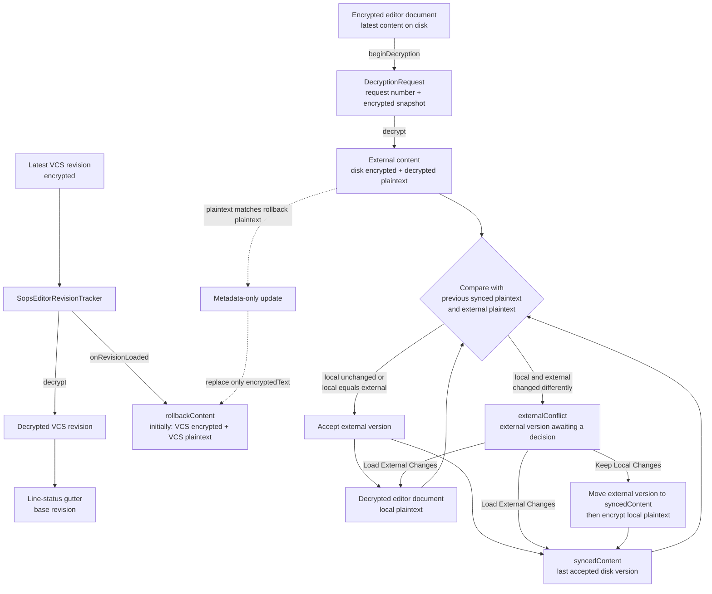
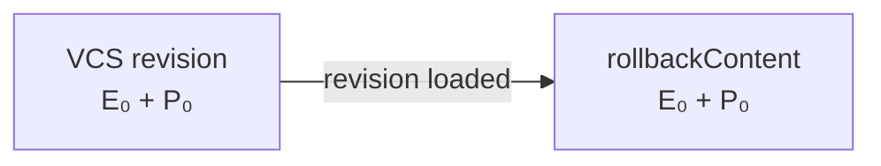
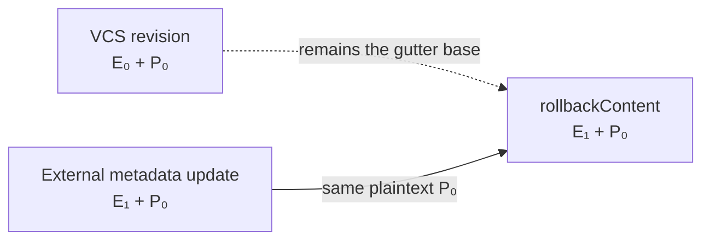
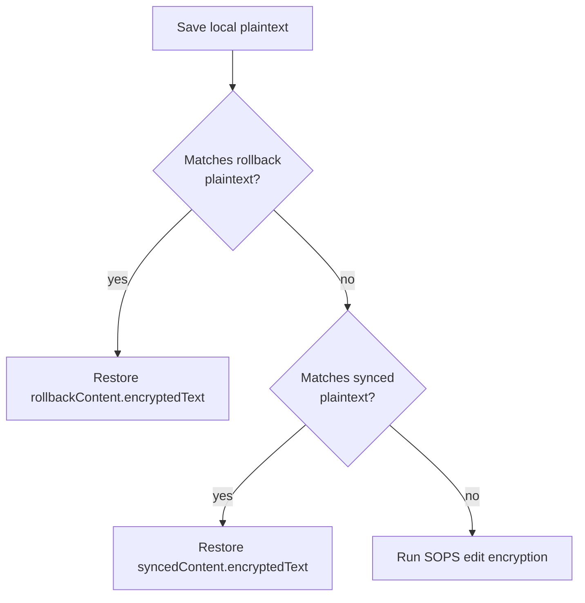

# SOPS editor content flow

The SOPS editor works with several versions of the same file. Each `SopsContent` contains both the
encrypted file text and the plaintext produced by decrypting it:

```text
SopsContent
├── encryptedText
└── decryptedText
```

## Content overview



## Responsibilities

| Value | Owner | Meaning | Used for |
| --- | --- | --- | --- |
| `encryptedRevision` | `SopsEditorRevisionTracker` | Encrypted text from the latest VCS revision | Avoiding repeated revision decryption |
| `decryptedRevision` | `SopsEditorRevisionTracker` | Plaintext from the latest VCS revision | Gutter change markers |
| `rollbackContent` | `SopsEditorContentState` | Plaintext baseline and ciphertext to restore when the editor returns to that plaintext | Undoing an edit without creating new SOPS ciphertext |
| `syncedContent` | `SopsEditorContentState` | Latest disk version accepted by the editor | Detecting local changes and preserving accepted external ciphertext |
| `externalConflict` | `SopsEditorContentState` | External disk version that conflicts with local plaintext | Waiting for the user to keep local or load external changes |
| Decrypted editor document | IntelliJ editor | Current local plaintext | What the user sees and edits |
| Encrypted editor document | IntelliJ editor | Current encrypted file content | What SOPS reads or the plugin restores |

## Revision and rollback relationship

The revision tracker and `rollbackContent` initially contain the same VCS content:



They can intentionally diverge after an external metadata-only operation such as
`sops updatekeys` or `sops rotate`. If the new ciphertext still decrypts to the rollback plaintext,
the plugin keeps that ciphertext as the new rollback target:



Here `E₀` and `E₁` are different encrypted representations, while `P₀` is the same plaintext.
Keeping `E₁` prevents a later editor save from undoing the externally updated SOPS metadata.

## Saving decrypted edits



The rollback comparison uses semantic formatting equality. Conflict detection uses exact plaintext
equality so the plugin does not silently choose between independently edited local and external
content.

## External change decision

Given:

- `local` = plaintext currently in the decrypted editor;
- `previous synced` = plaintext last accepted from disk;
- `external` = plaintext just decrypted from the changed encrypted file.

The decision is:

| Condition | Result |
| --- | --- |
| `local == previous synced` | The editor has no local edit, so load the external version |
| `local == external` | Both sides independently reached the same plaintext, so accept the external ciphertext |
| Otherwise | Store `externalConflict` and ask the user which version to keep |

Only the latest `DecryptionRequest` may make this decision. A result is discarded when a newer
request exists or the encrypted editor document no longer matches the request's encrypted snapshot.
