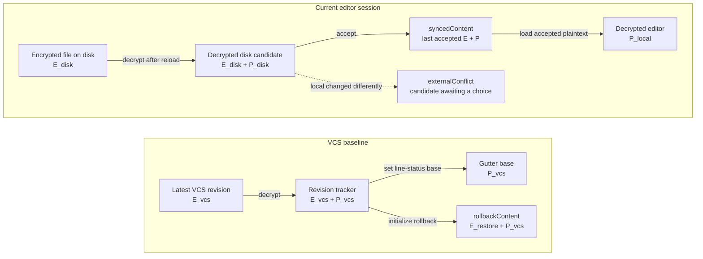
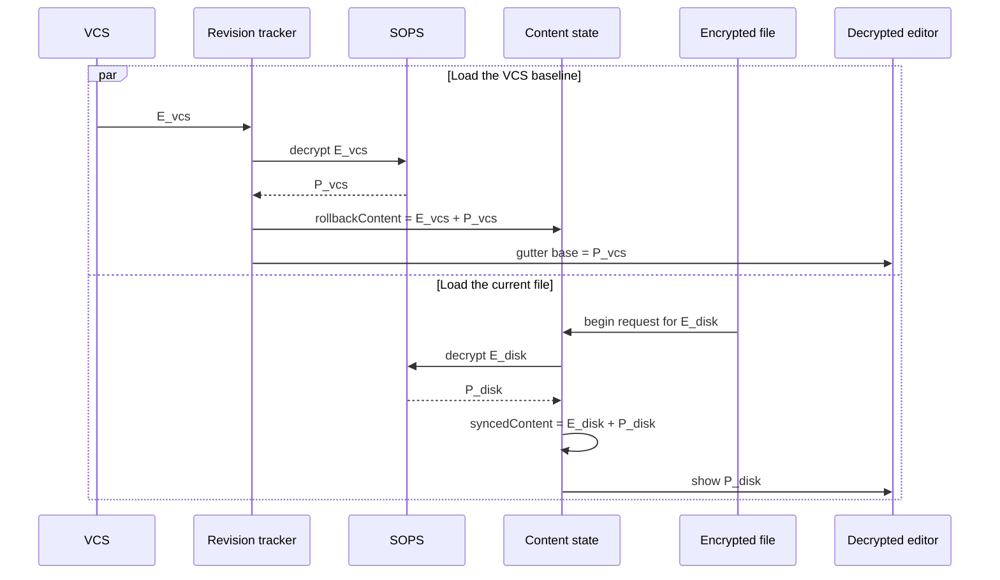
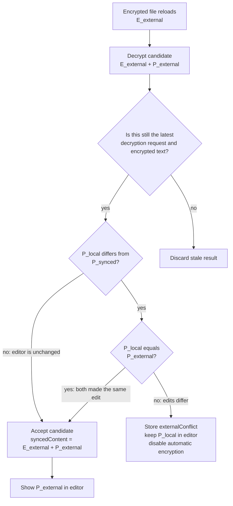
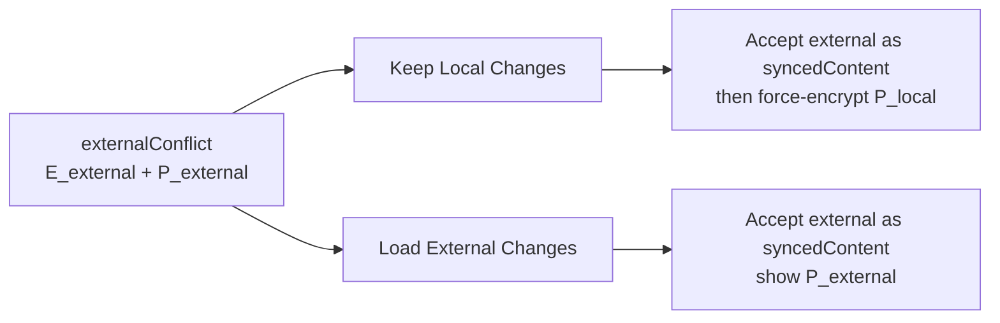
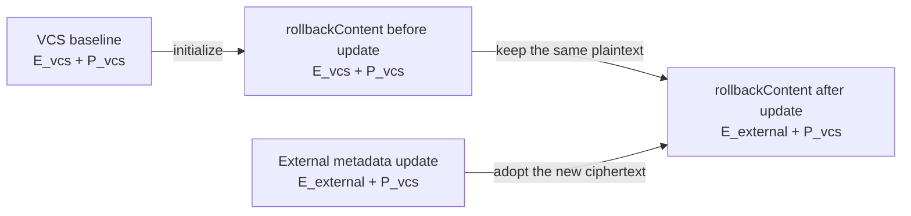
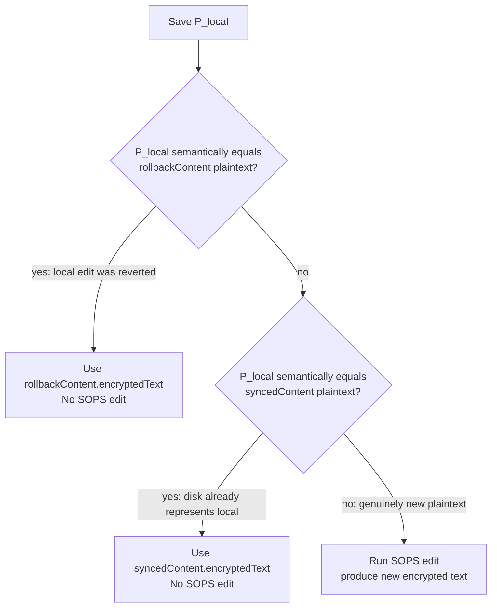

# SOPS editor content flow

The editor keeps several versions of a SOPS file because the VCS revision, the file on disk, and the
plaintext open in the editor can all be different at the same time.

In the diagrams:

- `E` means encrypted text;
- `P` means decrypted plaintext;
- a matching suffix means the two values represent one version, for example `E_disk + P_disk`.

Every `SopsContent` stores one such pair:

```text
SopsContent
├── encryptedText (E)
└── decryptedText (P)
```

## The content versions at a glance

There are two separate flows. The VCS flow establishes the rollback and gutter baseline. The disk
flow keeps the editor synchronized and detects concurrent changes.


```mermaid
flowchart LR
    subgraph vcsFlow["VCS baseline"]
        direction LR
        vcs["Latest VCS revision<br/>E_vcs"]
        tracker["Revision tracker<br/>E_vcs + P_vcs"]
        gutter["Gutter base<br/>P_vcs"]
        rollback["rollbackContent<br/>E_restore + P_vcs"]

        vcs -->|decrypt| tracker
        tracker -->|set line-status base| gutter
        tracker -->|initialize rollback| rollback
    end

    subgraph diskFlow["Current editor session"]
        direction LR
        disk["Encrypted file on disk<br/>E_disk"]
        candidate["Decrypted disk candidate<br/>E_disk + P_disk"]
        synced["syncedContent<br/>last accepted E + P"]
        local["Decrypted editor<br/>P_local"]
        conflict["externalConflict<br/>candidate awaiting a choice"]

        disk -->|decrypt after reload| candidate
        candidate -->|accept| synced
        synced -->|load accepted plaintext| local
        candidate -.->|local changed differently| conflict
    end

```

The two important baselines are therefore:

- `rollbackContent`: what to restore when the editor returns to the VCS plaintext;
- `syncedContent`: the most recent disk version accepted during this editor session.

`syncedContent` is not the rollback baseline. Its plaintext is used to detect concurrent changes,
and its ciphertext is preserved when it already represents the local plaintext.

## Opening the editor

The two flows start independently:


```mermaid
sequenceDiagram
    participant VCS
    participant Revision as Revision tracker
    participant SOPS
    participant State as Content state
    participant Disk as Encrypted file
    participant Editor as Decrypted editor

    par Load the VCS baseline
        VCS->>Revision: E_vcs
        Revision->>SOPS: decrypt E_vcs
        SOPS-->>Revision: P_vcs
        Revision->>State: rollbackContent = E_vcs + P_vcs
        Revision->>Editor: gutter base = P_vcs
    and Load the current file
        Disk->>State: begin request for E_disk
        State->>SOPS: decrypt E_disk
        SOPS-->>State: P_disk
        State->>State: syncedContent = E_disk + P_disk
        State->>Editor: show P_disk
    end
```

Usually both flows produce the same plaintext on initial load. They remain separate because the disk
can later change without changing the VCS revision.

## External file reload

A CLI command, Git operation, or another process can replace the encrypted file while the editor is
open. The plugin decrypts that file into a candidate and compares three plaintext values:

- `P_local`: plaintext currently in the editor;
- `P_synced`: plaintext last accepted from disk;
- `P_external`: plaintext from the new disk candidate.


```mermaid
flowchart TD
    reload["Encrypted file reloads<br/>E_external"]
    decrypt["Decrypt candidate<br/>E_external + P_external"]
    current{"Is this still the latest<br/>decryption request and encrypted text?"}
    localChanged{"P_local differs from<br/>P_synced?"}
    sameChange{"P_local equals<br/>P_external?"}
    accept["Accept candidate<br/>syncedContent = E_external + P_external"]
    show["Show P_external in editor"]
    conflict["Store externalConflict<br/>keep P_local in editor<br/>disable automatic encryption"]
    discard["Discard stale result"]

    reload --> decrypt
    decrypt --> current
    current -->|no| discard
    current -->|yes| localChanged
    localChanged -->|no: editor is unchanged| accept
    localChanged -->|yes| sameChange
    sameChange -->|yes: both made the same edit| accept
    sameChange -->|no: edits differ| conflict
    accept --> show
```

Only a divergent concurrent edit produces a warning. The warning offers two actions:


```mermaid
flowchart LR
    conflict["externalConflict<br/>E_external + P_external"]
    keep["Keep Local Changes"]
    load["Load External Changes"]
    syncedKeep["Accept external as syncedContent<br/>then force-encrypt P_local"]
    syncedLoad["Accept external as syncedContent<br/>show P_external"]

    conflict --> keep --> syncedKeep
    conflict --> load --> syncedLoad
```

## Revision and metadata-only updates

`rollbackContent` starts with the VCS content, but its encrypted text can intentionally change. For
example, `sops updatekeys` can produce new ciphertext and metadata without changing the plaintext:


```mermaid
flowchart LR
    vcs["VCS baseline<br/>E_vcs + P_vcs"]
    rollbackBefore["rollbackContent before update<br/>E_vcs + P_vcs"]
    external["External metadata update<br/>E_external + P_vcs"]
    rollbackAfter["rollbackContent after update<br/>E_external + P_vcs"]

    vcs -->|initialize| rollbackBefore
    rollbackBefore -->|keep the same plaintext| rollbackAfter
    external -->|adopt the new ciphertext| rollbackAfter
```

The revision tracker still represents `E_vcs + P_vcs` for the gutter. Only the encrypted half of
`rollbackContent` changes. If the editor later returns to `P_vcs`, it restores `E_external` instead
of undoing the updated SOPS keys or metadata.

## Saving decrypted edits

On a normal save, the plugin first checks whether an existing ciphertext already represents the
local plaintext:


```mermaid
flowchart TD
    save["Save P_local"]
    rollbackMatch{"P_local semantically equals<br/>rollbackContent plaintext?"}
    restoreRollback["Use rollbackContent.encryptedText<br/>No SOPS edit"]
    syncedMatch{"P_local semantically equals<br/>syncedContent plaintext?"}
    preserveSynced["Use syncedContent.encryptedText<br/>No SOPS edit"]
    encrypt["Run SOPS edit<br/>produce new encrypted text"]

    save --> rollbackMatch
    rollbackMatch -->|yes: local edit was reverted| restoreRollback
    rollbackMatch -->|no| syncedMatch
    syncedMatch -->|yes: disk already represents local| preserveSynced
    syncedMatch -->|no: genuinely new plaintext| encrypt
```

Save comparisons use semantic formatting equality. External conflict detection uses exact plaintext
equality so the plugin does not silently choose between independently edited local and external
content.

## Responsibilities

| Value | Owner | Meaning | Used for |
| --- | --- | --- | --- |
| `encryptedRevision` | `SopsEditorRevisionTracker` | Encrypted text from the latest VCS revision | Avoiding repeated revision decryption |
| `decryptedRevision` | `SopsEditorRevisionTracker` | Plaintext from the latest VCS revision | Gutter change markers |
| `rollbackContent` | `SopsEditorContentState` | VCS plaintext baseline plus the ciphertext that should represent it | Restoring reverted editor content without running SOPS |
| `syncedContent` | `SopsEditorContentState` | Latest disk version accepted by the editor | Detecting concurrent edits and preserving accepted ciphertext |
| `externalConflict` | `SopsEditorContentState` | New disk version that conflicts with local plaintext | Waiting for the user to keep local or load external changes |
| Decrypted editor document | IntelliJ editor | Current local plaintext | What the user sees and edits |
| Encrypted editor document | IntelliJ editor | Current encrypted file content | What SOPS reads or the plugin restores |
